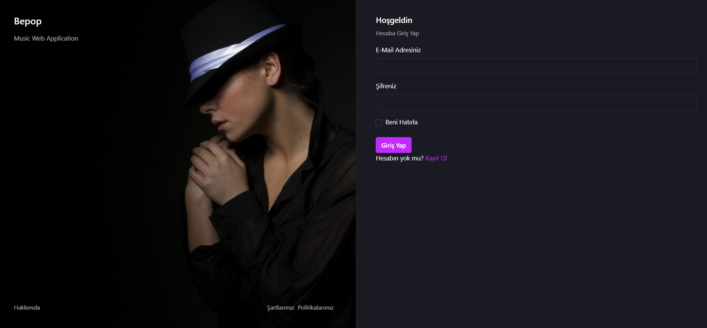
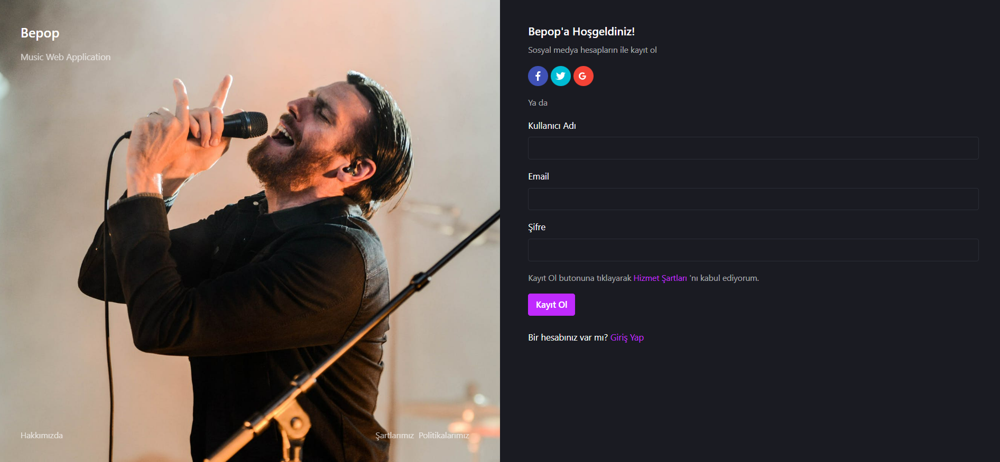
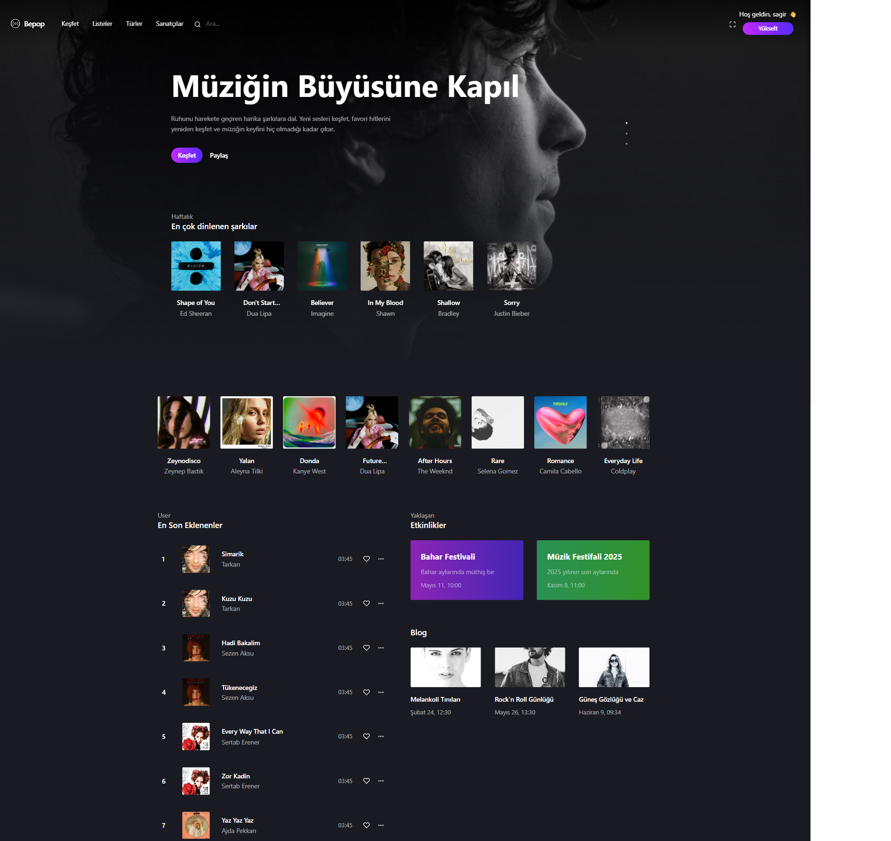
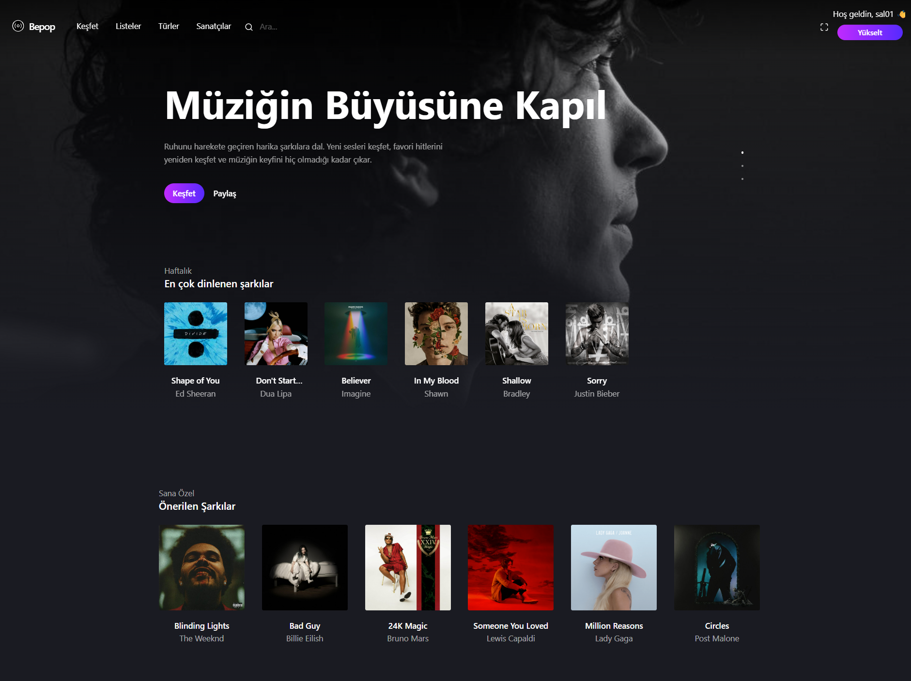
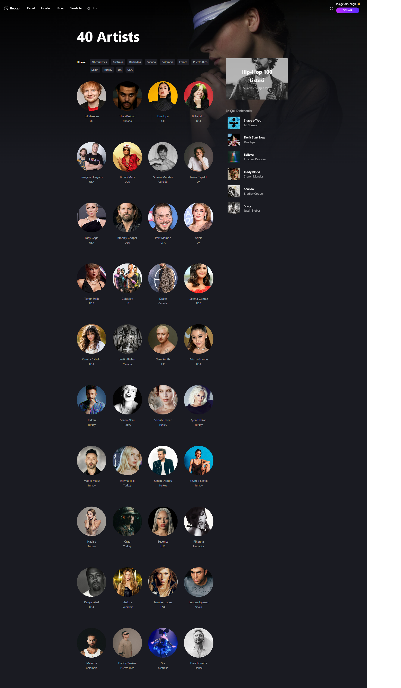
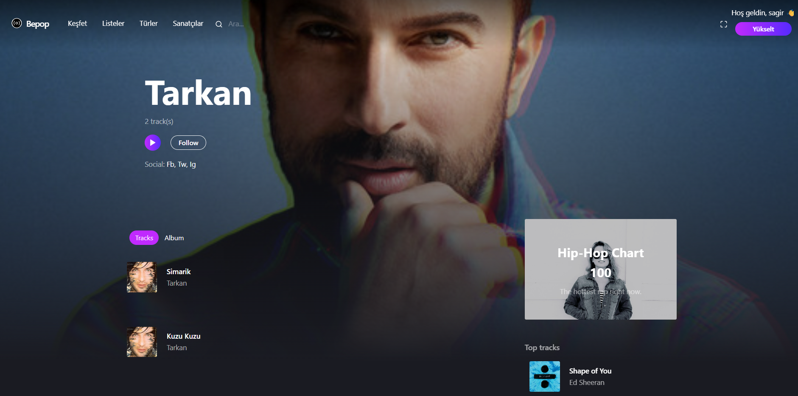
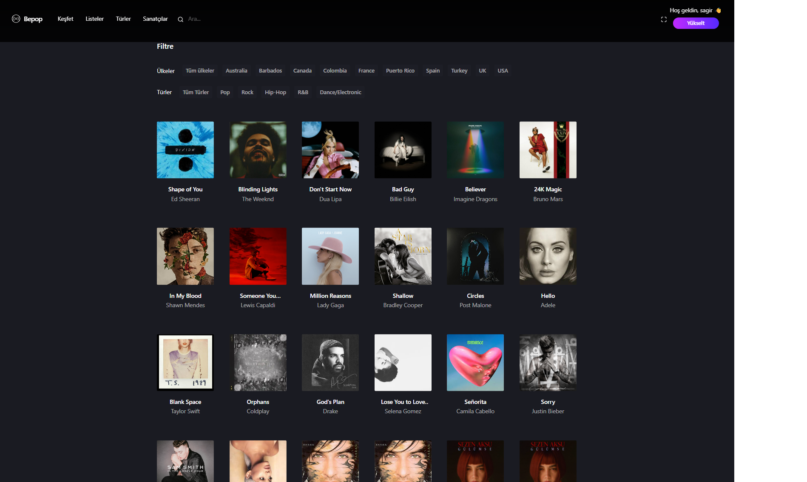
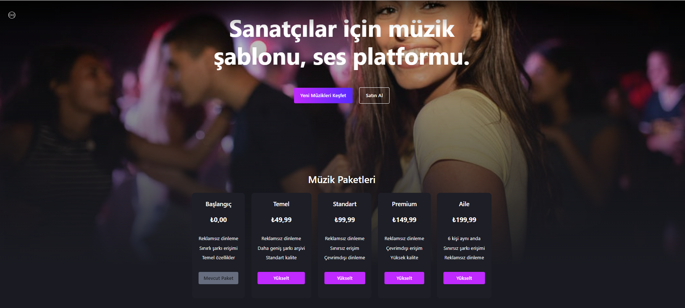
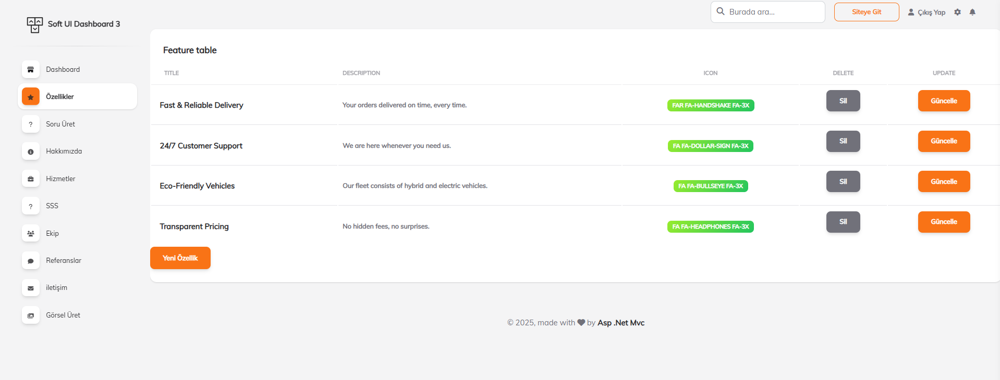
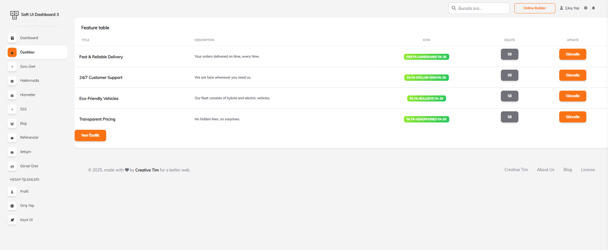

# 🎵 BepopStream – Müzik Dinleme ve Öneri Platformu  

**BepopStream**, kullanıcıların müzik dinleyebildiği, paket yükseltebildiği ve **ML.NET destekli öneri sistemi** ile kişiselleştirilmiş şarkı tavsiyeleri alabildiği modern bir web uygulamasıdır.  

Proje boyunca **JWT Authentication** ve **ML.NET Recommendation System** gibi ileri düzey teknolojiler kullanılarak güvenli ve akıllı bir altyapı oluşturulmuştur.  

---

## 🚀 Özellikler  

- 🔐 **JWT Authentication** ile güvenli kullanıcı girişi  
- 📦 Kullanıcı paket seviyesine göre şarkı dinleme sınırlamaları  
- 🎵 Şarkı, sanatçı, albüm bazlı filtreleme ve listeleme  
- 📊 **ML.NET Recommendation System** ile kişiselleştirilmiş şarkı önerileri  
- 📈 Dinleme geçmişine dayalı öneri motoru (**PlayHistory tablosu üzerinden**)  
- 🎨 Responsive arayüz (**Bootstrap + CSS3 + JavaScript**)  

---

## 🛠 Kullanılan Teknolojiler  

### Backend  
💻 **ASP.NET Core 6.0** – Modern backend geliştirme  
🗄 **Entity Framework Core** – ORM ve veritabanı işlemleri  
📊 **LINQ** – Veri sorgulama  
🛢 **Microsoft SQL Server** – Veritabanı yönetimi  

### Frontend  
🎨 **HTML5, CSS3, JavaScript, Bootstrap** – Arayüz tasarımı  

### Authentication  
🔐 **JWT Authentication** – Güvenli kimlik doğrulama  

### Machine Learning  
🤖 **ML.NET** – Öneri sistemi (**Matrix Factorization tabanlı**)  

---

## 📚 Öğrendiklerim  

Bu proje sürecinde:  
- **JWT (JSON Web Token) Authentication** yapısını derinlemesine öğrendim ve kullanıcı doğrulama/authorization mekanizmasını projeye entegre ettim.  
- **ML.NET ile Recommendation System** kurarak kullanıcıların dinleme alışkanlıklarına göre kişiselleştirilmiş şarkı tavsiyeleri sunmayı başardım.  

---

## 📸 Proje Görselleri  

### 🔑 Kimlik Doğrulama  
- **Login Sayfası**  
    

- **Register Sayfası**  
    

---

### 🎶 Keşfet Sayfaları  
- **Discover**  
    

- **Discover – Öneriler**  
    

---

### 🎼 Sanatçı & Tür Sayfaları  
- **Artists**  
    

- **Artist Detail**  
    

- **Genres**  
    

---

### 📦 Paketler & Yönetim  
- **Packages**  
    

- **Admin Feature**  
    

---

### 📊 Dashboard  
  

---

## ⚡ Projeyi Çalıştırma  

```bash
# Projeyi klonla
git clone https://github.com/kullaniciadi/BepopStream.git

# Proje klasörüne gir
cd BepopStream

# Migration ve veritabanı güncelle
dotnet ef database update

# Uygulamayı başlat
dotnet run
